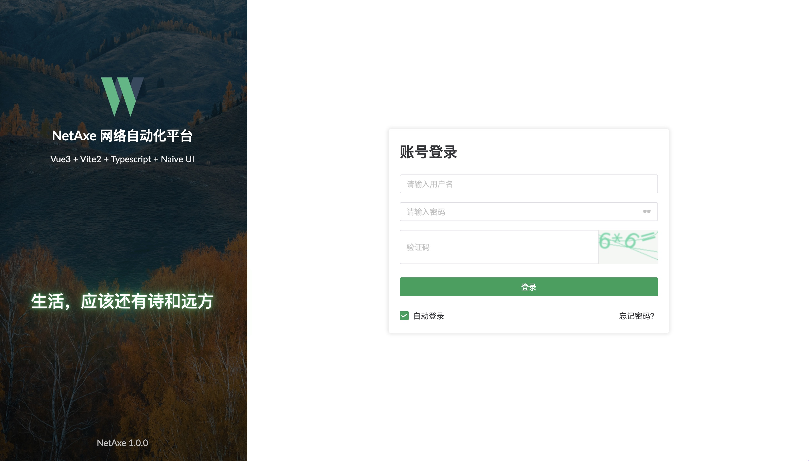
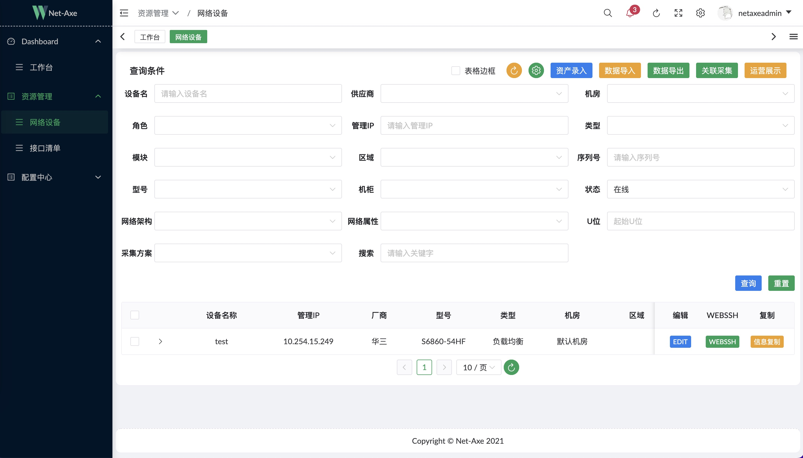
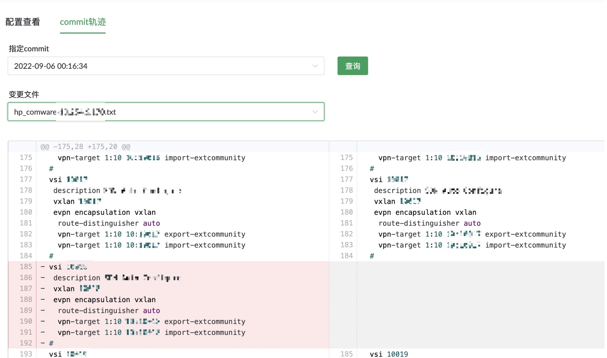

<a href='https://gitee.com/IFLY-DevNet/net-axe/stargazers'></img></a>
<a href='https://gitee.com/IFLY-DevNet/net-axe/members'></img></a>

[](https://gitee.com/IFLY-DevNet/net-axe)

## 🌟 介绍

网络自动化平台
功能:

1. 资产管理
2. 配置备份(nornir)
3. 配置差异比较
4. webssh
5. 设备数据的统一采集并统一数据格式(celery 多进程+netmiko)
6. 设备接口利用率分析

## 功能概要


## 平台截图

1. 登录页  
   
2. 资产管理
   
3. 差异比较
   

## 安装教程

安装前置条件
操作系统 : centos 7.×  
docker 版本 >= 18.9  
docker-compose 版本 >= 1.18.0  
配置差异比较依赖 git 配置，请确认有现成的 git 仓库可以用来保存设备配置数据

### 直接运行方式(适用于 amd64 系统，在 centos7 上验证通过)

1. 更新 docker 配置文件

```shell
   sudo tee /etc/docker/daemon.json <<-'EOF'
   {
   "registry-mirrors": ["https://tawedu6l.mirror.aliyuncs.com"]
   }
   EOF
   sudo systemctl daemon-reload
   sudo systemctl restart docker
```

2. 配置一下网络设备配置备份目录的 git 初始化

```shell
   克隆项目到本地 是项目的正确打开方式， 会第一时间享受到功能的更新以及问题优化
   # 这一步是克隆项目到本地
   git clone https://gitee.com/IFLY-DevNet/net-axe.git
   mkdir -p netaxe/media/device_config/current-configuration
   cd netaxe/media/device_config
   # 下面是需要单独再建立一个git关联你自己的git仓库，专门用来管理网络设备配置文件的，跟项目git不冲突也没关系
   git init
   git remote add origin 仓库地址
   git fetch
   git checkout master
   git branch --set-upstream-to=origin/master master
```

3. 进入到 docker 目录下 先启动数据库

```shell
   cd docker/databases
   docker-compose up -d
```

4. 配置 conf 文件

```shell
   cd netaxe/netboost
   cp conf_bak.py conf.py
   vi conf.py
   注意：这里要将服务器的网卡IP填写到mysql和mongo的配置项中，必须配置好IP
```

5. 进入到 server 目录下，启动服务

```shell
   cd docker/server
   docker-compose -f init.yml up -d
```

6. 数据初始化(docker/server 路径下)

```shell
  进入后端服务容器命令行
  docker exec -it netaxe-server /bin/bash
   python3 manage.py migrate
   python3 manage.py makemigrations asset
   python3 manage.py migrate asset
   python3 manage.py makemigrations rest_framework_tracking
   python3 manage.py migrate rest_framework_tracking
   python3 manage.py init_asset
   python3 manage.py init_route
   python3 manage.py createsuperuser # 新建管理员账户，要输入管理员账户和密码
   exit
```

7. 关闭初始化用的服务(docker/server 路径下)

```shell
   关闭该路径下所有容器服务
   docker-compose -f init.yml down -v
```

8. 重新启动后端服务(docker/server 路径下)

```shell
   docker-compose up -d
```

### 本地构建方式

1. 克隆项目到本地  
   git clone https://gitee.com/IFLY-DevNet/net-axe.git
2. 进入项目目录  
   cd net-axe
3. 打包后端镜像  
   cd netaxe  
   wget http://npm.taobao.org/mirrors/python/3.9.11/Python-3.9.11.tgz  
   docker build -t registry.cn-hangzhou.aliyuncs.com/netaxe/netaxe-backend:1.0.2 .
4. 打包前端镜像  
   cd web  
   docker build -t registry.cn-hangzhou.aliyuncs.com/netaxe/netaxe-web:1.0.3 .

## 软件架构

软件架构说明

### 🚀 前端 vue admin work

环境准备
该项目本地环境需要安装

##### Node 版本: v16.13.1

##### npm 版本: v6.14.5

##### Git 版本: v2.23.0

### 后端 Django + celery

## 参与贡献

1. Fork 本仓库
2. 新建 Feat_xxx 分支
3. 提交代码
4. 新建 Pull Request

# 💖 感谢伟大的[Django](https://github.com/django/django)、[VUE](https://github.com/vuejs/vue)、[vue-admin-work](https://github.com/qingqingxuan/vue-admin-work)
